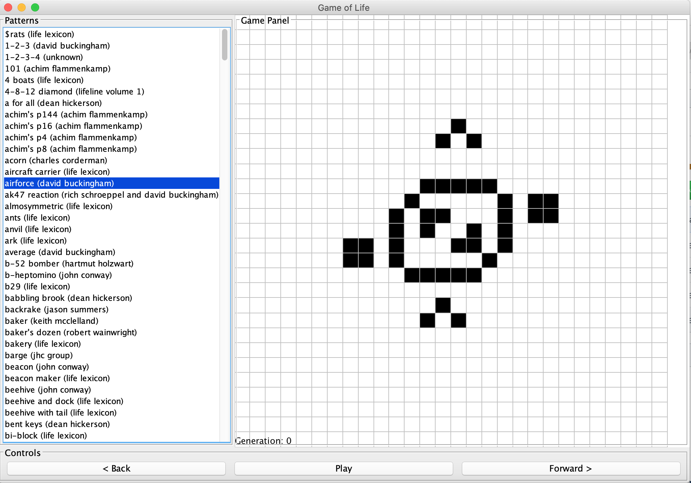
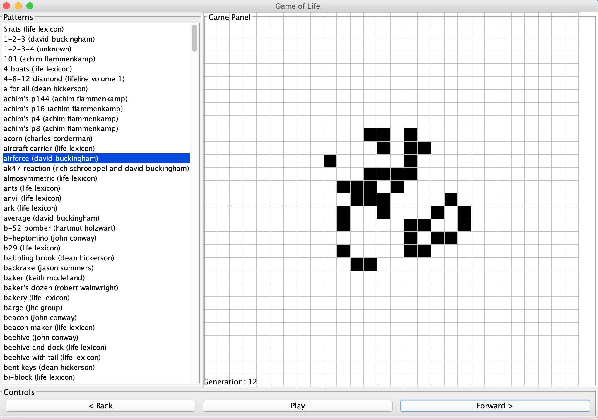

# Interactive Game of Life
Creating the Game of Life App in Java, using OOP Methods and a touch of GUI to make it interactive.



Game of Life Game panel at Generation 0 



Game of Life Game panel for same pattern at Generation 12


## Setup

```
javac uk/ac/cam/jsc89/oop/tick5/GUILife.java
java uk.ac.cam.jsc89.oop.tick5/GUILife
```
## How Program initialises
- Takes input which a text file of multiple starting patterns for the game in the form
``glider:richard k. guy:8:8:1:1:001 101 011``
- The string is broken down into the paramenters of the game board e.g. height/width/starting positions etc and added to the list which is shown in the Patterns menu.
- The code produces an adjustable interface in which you can select a pattern to play, scroll through possible patterns (which are in alphabetical order), and buttons to play the game.
- The Game commences by selecting a pattern from the list and pressing the start button or using the forward and back keys which pause the game at that point.
- A new pattern can used by just pressing it on the list and carrying on as before.

## Acknoledgements

Dr. Robert Harle - taught the OOP course and provided the testing document.
